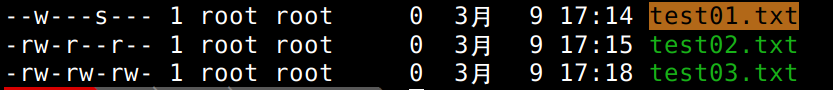

# linux_learn
学习linux相关及编程

### linux01
**进程初学**

-------
### linux02
**进程初学**

-------
### linux03
**手动创建进程fork函数**

-------
### linux04
**一次创建多个进程**

-------
### linux05
**进程状态**

-------
### linux06
**进程优先级,linux的调度和切换**

-------
### linux07
**环境变量**

-------
### linux08
**进程地址空间**

-------
### linux09
**进程控制1(进程退出，进程等待)**

-------
### linux10
**进程控制2(进程退出，进程程序替换)**

-------
### linux11
**自定义shell**

-------
### linux12
**文件系统初学**
**open创建文件的时候,分别为不添加默认权限，添加默认权限，去掉系统权限掩码的情况**

-------
