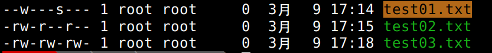

# linux_learn
学习linux相关及编程
大二的时候跟着bite学习，大三大四后面断断续续学习没有记录，研一继续学习


### linux11
**自定义shell**


### linux12
**文件系统初学**
**open创建文件的时候,分别为不添加默认权限，添加默认权限，去掉系统权限掩码的情况**



### linux13
**文件fd**
```
对于每一个文件，操作系统都创建了一个struct file
struct file{
    int type;
    int status;
    int (*readp)();   //函数指针
    int (*writep)();
}
```

